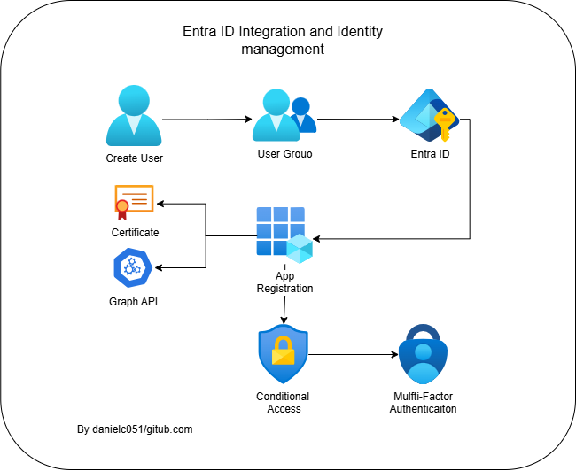

# 🔐 Entra ID Integration and Identity Management

## 📖 Summary

This project demonstrates integrating applications with Entra ID, managing users and groups, setting up conditional access policies, enabling MFA, and monitoring authentication activity.

## 🏢 Scenario

A company wants to integrate their web application with Entra ID for authentication, manage user and group permissions, enforce conditional access policies, and enable multi-factor authentication (MFA) for added security.

## 🛠️ Steps

### 👥 Create Users and Groups in Entra ID

- Navigate to **Entra ID** → **Users** → **Create User**.
- Create a few users with different roles (e.g., Admin, Developer, Reader).
- Go to **Groups** → **Create Group** → Add the newly created users.

### 📱 Register an Application in Entra ID

- Navigate to **App Registrations** → **New Registration**.
- Enter a name, supported account types, and redirect URI (e.g., for a web application).
- **API Permissions:** Add permissions for **Microsoft Graph** (e.g., `User.Read`).
- **Certificates & Secrets:** Create a client secret for the application.

### 🔗 Assign Users and Groups to the Application

- Go to **Enterprise Applications** → Select the newly registered app.
- Navigate to **Users and Groups** → **Add User/Group**.
- Assign the previously created groups to the application.

### 🛡️ Configure Conditional Access

- Navigate to **Entra ID** → **Security** → **Conditional Access** → **New Policy**.
- Create a policy to require MFA for all users accessing the application.
- Set conditions, such as location-based access or device compliance requirements.
- Enable the policy and test by logging in with different users.

### 🔑 Enable Multi-Factor Authentication (MFA)

- Go to **Entra ID** → **Users** → **Multi-Factor Authentication**.
- Enable MFA for selected users.
- Test the login process to ensure MFA is required.

### 📊 Monitor Sign-In Activity

- Navigate to **Entra ID** → **Sign-ins**.
- Review sign-in logs to verify successful and failed authentication attempts.

## 🎯 Learning Outcomes

By completing this project, you will be able to:

- Create and manage users and groups in Entra ID
- Register and configure applications for authentication
- Assign users and groups to enterprise applications
- Implement Conditional Access policies
- Enable and test Multi-Factor Authentication (MFA)
- Monitor and analyze authentication activity using sign-in logs