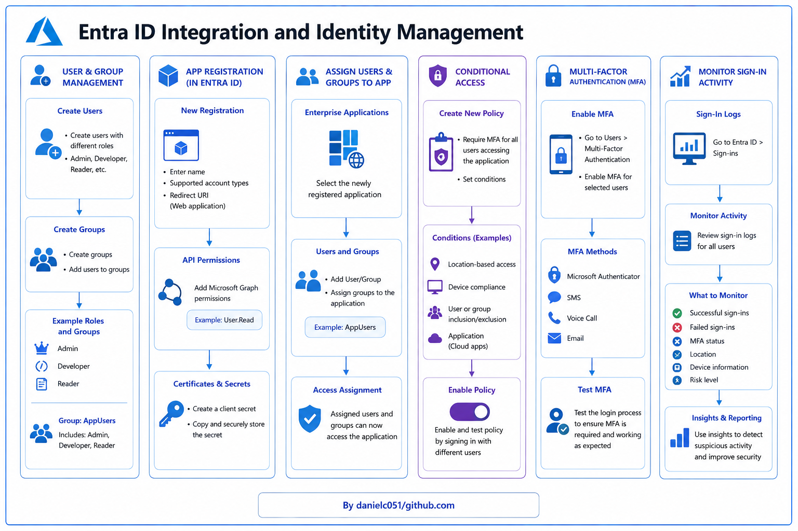

# 🔐 Azure Entra ID Integration and Identity Management

**Topics Covered:** Azure Entra ID, User and Group Management, App Registration, Enterprise Applications, Conditional Access, Multi-Factor Authentication (MFA), Sign-In Monitoring

---

  

---

## 📖 Summary

This project focuses on integrating applications with Azure Entra ID for secure authentication and identity management. It demonstrates how to create and manage users and groups, register applications, assign permissions, enforce Conditional Access policies, enable Multi-Factor Authentication (MFA), and monitor authentication activity.

---

## 🏢 Scenario

A company wants to integrate its web application with Azure Entra ID for authentication, manage user and group permissions, enforce Conditional Access policies, and enable Multi-Factor Authentication (MFA) to strengthen security across the organization.

---

## 🛠️ Steps

### 1️⃣ 👥 Create Users and Groups in Entra ID

- Navigate to **Azure Entra ID** → **Users** → **New User**.
- Create several users with different roles:
  - Administrator
  - Developer
  - Reader
- Navigate to **Groups** → **New Group**.
- Create a security group.
- Add the newly created users to the group.
- Verify group membership.

---

### 2️⃣ 📱 Register an Application in Entra ID

- Navigate to **App Registrations** → **New Registration**.
- Configure:
  - Application Name
  - Supported Account Types
  - Redirect URI (Web Application)
- Complete the registration process.
- Configure API permissions:
  - Microsoft Graph → **User.Read**
- Navigate to **Certificates & Secrets**.
- Create a new client secret.
- Save the secret value securely.

---

### 3️⃣ 🔗 Assign Users and Groups to the Application

- Navigate to **Enterprise Applications**.
- Select the newly registered application.
- Open **Users and Groups**.
- Select **Add User/Group**.
- Assign the previously created group to the application.
- Verify access assignments.

---

### 4️⃣ 🛡️ Configure Conditional Access Policies

- Navigate to **Azure Entra ID** → **Security** → **Conditional Access**.
- Select **New Policy**.
- Configure:
  - Target Users or Groups
  - Target Application
- Set access controls:
  - Require Multi-Factor Authentication
- Configure optional conditions:
  - Location-based access
  - Device compliance requirements
  - Risk-based sign-in controls
- Enable the policy.
- Test access using different user accounts.

---

### 5️⃣ 🔑 Enable Multi-Factor Authentication (MFA)

- Navigate to **Azure Entra ID** → **Users**.
- Select users requiring MFA.
- Enable Multi-Factor Authentication.
- Configure authentication methods:
  - Microsoft Authenticator App
  - SMS
  - Phone Call
- Test the sign-in process.
- Verify MFA challenges are enforced.

---

### 6️⃣ 📊 Monitor Sign-In Activity

- Navigate to **Azure Entra ID** → **Monitoring & Health** → **Sign-In Logs**.
- Review authentication activity:
  - Successful sign-ins
  - Failed sign-ins
  - Conditional Access results
  - MFA status
- Filter logs by:
  - User
  - Application
  - Date and time
- Investigate authentication events and security insights.

---

## 🎯 Learning Outcomes

By completing this project, you will be able to:

- Create and manage Azure Entra ID users and groups
- Register applications for Azure-based authentication
- Configure Microsoft Graph API permissions
- Assign users and groups to enterprise applications
- Implement Conditional Access policies
- Enable and manage Multi-Factor Authentication (MFA)
- Monitor authentication and sign-in activity
- Improve organizational security using identity-based controls

---

## ✅ Services Used

- Azure Entra ID
- App Registrations
- Enterprise Applications
- Microsoft Graph API
- Conditional Access
- Multi-Factor Authentication (MFA)
- Sign-In Logs
- Azure Monitoring & Health

---

## 📚 Key Concepts

| Feature | Purpose |
|----------|----------|
| Azure Entra ID | Identity and access management service |
| Users & Groups | Manage access and permissions |
| App Registration | Enable application authentication |
| Enterprise Applications | Manage application access assignments |
| Conditional Access | Enforce access policies based on conditions |
| MFA | Add an additional authentication factor |
| Microsoft Graph | Access Microsoft identity and directory data |
| Sign-In Logs | Monitor authentication activity and security events |

This project provides hands-on experience with identity management, authentication, authorization, and security controls using Azure Entra ID.